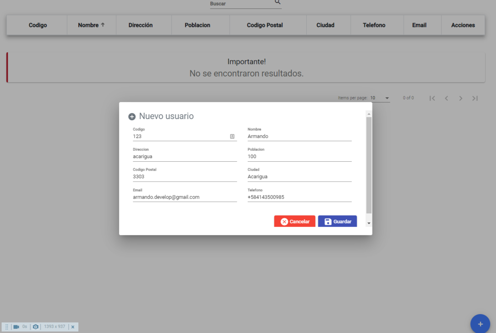
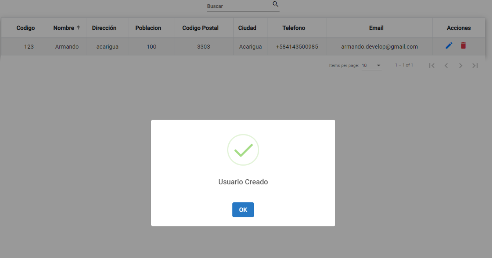

# Users List

- Angular 11
- Angular Material

   

   

## Install

### Step 1:

`cd backend/`

### Step 2

`npm install`

### Step 3

`npm run build`

### Step 4

`npm start`

### Step 5

`cd ../app`

### Step 6

`npm install`

### Step 7

`ng serve`
